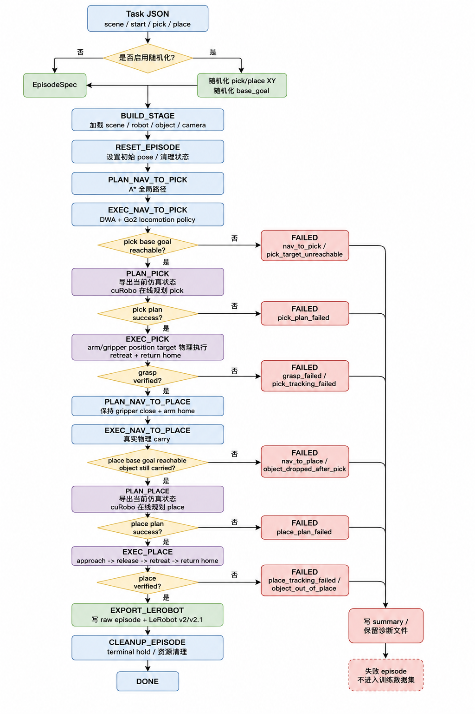
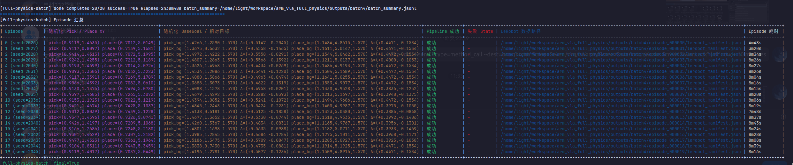
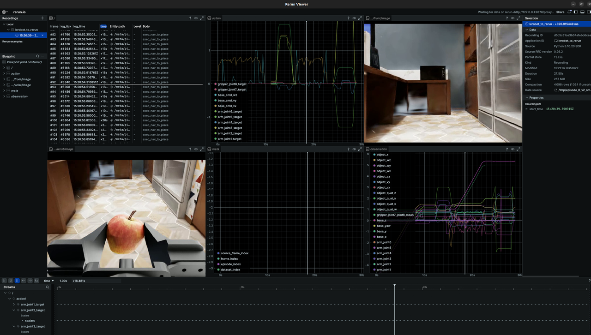

# Go2-X5 loco-manipulation pipeline

**本仓库实现loco-manipulation的数据采集流程，导出用于VLA模型训练的数据集**

大致流程为：


## 一、环境依赖

### Isaac Sim 5.1 / Isaac Lab 环境


| Package                  | Version        | 用途                            |
| ------------------------ | -------------- | ------------------------------- |
| Python                   | `3.11.15`      | Isaac Sim 5.1 当前环境 Python   |
| `isaacsim`               | `5.1.0.0`      | Isaac Sim Kit / runtime         |
| `isaacsim-core`          | `5.1.0.0`      | Isaac Sim core API              |
| `isaacsim-kernel`        | `5.1.0.0`      | Isaac Sim kernel 依赖           |
| `isaaclab`               | `0.54.3`       | Isaac Lab runtime               |
| `isaaclab-rl`            | `0.4.7`        | Isaac Lab RL wrapper            |
| `rsl-rl-lib`             | `3.1.2`        | Go2-X5 locomotion policy runner |
| `rl-games`               | `1.6.1`        | Isaac Lab 依赖                  |
| `nvidia-curobo`          | `0.0.0`        | cuRobo planner                  |
| `warp-lang`              | `1.13.0`       | cuRobo / NVIDIA Warp            |
| `torch`                  | `2.7.0+cu128`  | CUDA tensor / policy / planner  |
| `torchvision`            | `0.22.0+cu128` | 图像工具                        |
| `torchaudio`             | `2.7.0+cu128`  | torch 环境配套包                |
| `numpy`                  | `1.26.0`       | Isaac Sim 兼容 NumPy            |
| `scipy`                  | `1.15.3`       | 数值工具                        |
| `packaging`              | `23.0`         | Isaac Sim 版本约束              |
| `psutil`                 | `5.9.8`        | Isaac Sim kernel 版本约束       |
| `websockets`             | `12.0`         | Isaac Sim kernel 版本约束       |
| `pillow`                 | `11.3.0`       | 图像保存                        |
| `opencv-python-headless` | `4.11.0.86`    | MP4 编码和帧处理                |
| `pyarrow`                | `24.0.0`       | LeRobot parquet 物化            |
| `pandas`                 | `3.0.3`        | 表格处理                        |
| `tqdm`                   | `4.67.3`       | 进度条                          |
| `imageio`                | `2.37.0`       | 视频/图像 I/O                   |
| `imageio-ffmpeg`         | `0.6.0`        | ffmpeg 后端                     |
| `gymnasium`              | `1.2.1`        | Isaac Lab env API               |
| `hydra-core`             | `1.3.2`        | Isaac Lab 配置                  |
| `omegaconf`              | `2.3.0`        | Hydra 配置                      |
| `trimesh`                | `4.5.1`        | mesh / collision 诊断           |
| `networkx`               | `3.3`          | 图搜索辅助                      |
| `matplotlib`             | `3.10.3`       | debug 可视化                    |

可以使用以下命令创建一个conda虚拟环境

```bash
conda create -n isaac_locomani python=3.11 -y
conda activate isaac_locomani
python -m pip install -r requirements/isaacsim51_runtime.txt
```

### LeRobot / Rerun 环境


| Package           | Version        | 用途                           |
| ----------------- | -------------- | ------------------------------ |
| Python            | `3.10.20`      | LeRobot/Rerun 普通 Python 环境 |
| `lerobot`         | `0.4.4`        | LeRobot v2 dataset API         |
| `rerun-sdk`       | `0.26.2`       | `.rrd` 可视化记录              |
| `numpy`           | `2.2.6`        | 数组处理                       |
| `pandas`          | `2.3.3`        | parquet / metadata 检查        |
| `pyarrow`         | `24.0.0`       | LeRobot parquet 读取           |
| `pillow`          | `12.2.0`       | 图片读取                       |
| `opencv-python`   | `4.13.0.92`    | 视频帧处理                     |
| `tqdm`            | `4.68.2`       | 转换进度                       |
| `imageio`         | `2.37.3`       | 视频/图像 I/O                  |
| `imageio-ffmpeg`  | `0.6.0`        | ffmpeg 后端                    |
| `torch`           | `2.10.0+cu128` | LeRobot tensor 数据            |
| `torchvision`     | `0.25.0+cu128` | 图像 tensor 工具               |
| `pyyaml`          | `6.0.3`        | metadata 配置                  |
| `huggingface-hub` | `0.35.3`       | LeRobot/HF 数据集工具          |
| `datasets`        | `4.8.5`        | HF dataset 工具                |
| `safetensors`     | `0.8.0`        | torch/模型数据依赖             |
| `av`              | `15.1.0`       | 视频解码依赖                   |
| `packaging`       | `25.0`         | 版本解析                       |

可以使用以下命令创建一个conda虚拟环境

```bash
conda create -n lerobot_rerun python=3.10 -y
conda activate lerobot_rerun
python -m pip install -r requirements/lerobot_rerun.txt
```

## 二、文件结构

当前主要结构：

```text
scripts/
└── pipeline/
    ├── run_full_physics_pipeline.py        # 单 episode / smoke 入口
    ├── run_full_physics_batch.py           # 批量自动化入口
    └── validate_lerobot_episode.py         # LeRobot 数据集校验入口

tools/
└── lerobot_to_rerun.py                     # LeRobot episode -> Rerun .rrd

source/
├── interfaces/                             # 跨模块协议层，只定义数据结构和抽象接口
│   ├── navigation.py                       # NavGoal / NavPlan / NavigationPlanner / NavigationExecutor
│   ├── manipulation.py                     # ArmPlan / RobotAction / ManipulationPlanner / ArmExecutor
│   ├── simulation.py                       # SimulationState / SimulationRuntime / action apply 协议
│   ├── recording.py                        # EpisodeRecorder / 数据记录接口
│   ├── task.py                             # EpisodeSpec / TaskProvider 任务协议
│   └── verification.py                     # VerificationResult / 成功判据接口
├── pipeline/                               # full-physics 状态机和主循环
│   ├── config.py                           # FullPhysicsConfig 及 nav/manip/randomization/recording 参数
│   ├── states.py                           # PipelineState 枚举
│   ├── events.py                           # PipelineEvent 事件结构
│   ├── state_machine.py                    # nav -> pick -> carry nav -> place -> export 状态机
│   ├── full_physics_pipeline.py            # 单 World step loop、summary、LeRobot export 调度
│   ├── factory.py                          # 组装 nav planner、manip planner、executor、runtime、recorder
│   ├── dry_run.py                          # 无 Isaac 依赖的控制流 dry-run factory
│   ├── simulation_smoke.py                 # stage/reset smoke factory
│   ├── navigation_smoke.py                 # nav-only / carry-nav smoke factory
│   ├── manipulation_smoke.py               # manipulation contract smoke factory
│   ├── manipulation_apply_smoke.py         # 真实 Isaac action apply smoke factory
│   └── isaac_compat.py                     # Isaac/Kit 兼容辅助
├── simulation/                             # Isaac Sim / Isaac Lab runtime 与 USD patch
│   ├── isaaclab_runtime.py                 # 当前 full-physics 主 runtime，负责场景、传感器、状态导出、step
│   ├── isaac_runtime.py                    # 轻量 Isaac Sim runtime，保留给 apply/smoke 路径
│   ├── action_applier.py                   # arm/gripper/base action 下发与 tracking report
│   ├── collision_patch.py                  # 夹爪/苹果 collision approximation 与 offset patch
│   ├── visibility_patch.py                 # 视觉层隐藏/显示 patch，例如隐藏碰撞苹果 mesh
│   ├── viewport.py                         # GUI viewport camera 选择与同步
│   └── in_memory.py                        # 测试用内存 simulation backend
├── navigation/                             # A* / DWA / Go2 locomotion policy 封装
│   ├── planner_adapter.py                  # 将 navlib A*/DWA 包装为 NavigationPlanner
│   ├── executor.py                         # waypoint / velocity command 执行器
│   ├── dry_run.py                          # 无 Isaac 的导航 dry-run
│   ├── adapters/
│   │   ├── dwa_nav_adapter.py              # DWA 局部规划 adapter
│   │   ├── isaaclab_go2_adapter.py         # IsaacLab Go2-X5 locomotion policy adapter
│   │   ├── frame_utils.py                  # world/map/body 坐标变换
│   │   ├── stall_detector.py               # 导航卡住检测
│   │   ├── terrain_utils.py                # terrain / collision 辅助
│   │   └── yaw_align.py                    # 终端 yaw 对齐控制
│   └── navlib/
│       ├── astar.py                        # 全局 A* 路径规划
│       ├── dwa.py                          # DWA 速度采样与 rollout
│       ├── grid_map.py                     # occupancy grid 数据结构
│       ├── path_tracking.py                # waypoint lookahead / tracking
│       ├── rasterization.py                # USD collision -> occupancy rasterization
│       └── serialization.py                # nav map JSON/PGM 读写
├── manipulation/                           # cuRobo 在线规划、机械臂执行、夹爪控制
│   ├── current_state_curobo.py             # 从当前仿真状态导出 cuRobo pick/place state + target
│   ├── grasp_pipeline.py                   # cuRobo planner-only wrapper，server 或 one-shot fallback
│   ├── planner_server_process.py           # 自动启动/复用 grasp_planner_server.py
│   ├── curobo_adapter.py                   # cuRobo JSON plan -> ArmPlan segment 转换
│   ├── arm_executor.py                     # 分段轨迹 tracking、strict wait、return-home、open/close 时序
│   ├── gripper_controller.py               # 二值夹爪 open/close target 生成
│   ├── smoke.py                            # manipulation smoke planner
│   └── dry_run.py                          # manipulation dry-run planner/executor
├── diagnostics/                            # 成功判据、调试可视化、报告
│   ├── full_physics.py                     # pick/carry/place success verifier
│   ├── navigation.py                       # navigation verifier
│   ├── manipulation_apply.py               # action apply smoke verifier
│   ├── integrated_apply.py                 # 历史诊断兼容；不作为主入口
│   ├── randomization_debug.py              # pick/place/base_goal 随机区域可视化
│   └── dry_run.py                          # dry-run verifier
├── recording/                              # full-physics raw frames 与 LeRobot v2 写出
│   ├── jsonl_recorder.py                   # frames/events/samples/jsonl 与 LeRobot export 调度
│   ├── lerobot_dataset.py                  # LeRobot v2 parquet/video/meta 写出
│   └── lerobot_validator.py                # LeRobot v2 结构、时间戳、feature 校验
├── data/                                   # 旧数据 schema / converter 兼容层
│   ├── task_schema.py                      # task JSON dataclass/schema helper
│   ├── random_task.py                      # 旧随机任务生成 helper
│   ├── episode_recorder.py                 # 旧多 phase CSV recorder
│   ├── vla_episode_recorder.py             # VLA episode recorder 兼容接口
│   └── lerobot_converter.py                # 旧 LeRobot converter 兼容接口
├── tasks/                                  # task loader 与随机化逻辑
│   ├── task_loader.py                      # JSON task -> EpisodeSpec
│   ├── randomizer.py                       # 通用 pick/place XY 和 base_goal 随机化
│   └── forward_sector_randomization.py     # 良渚机器人前向扇区联合随机化
├── scene/                                  # USD 场景、物体资产和导航地图
│   ├── 839920_go2_x5.usd                   # 当前主场景 USD
│   ├── nav_maps/839920/                    # occupancy map / metadata
│   ├── apple/                              # apple visual/collision asset
│   ├── bottle/                             # distractor asset
│   └── orange/                             # distractor asset
├── robot/                                  # Go2-X5 URDF / robot 资产源文件
└── robot_lab/                              # Isaac Lab extension / Go2-X5 task registration

tasks/
└── nav_pick_place_apple_contact.json       # 当前主任务

checkpoints/
└── go2_x5/flat/model_8500.pt               # 本地 locomotion checkpoint，通常不提交 git
```

## 三、Pipeline 流程

!

状态流：

```text
build_stage
-> reset_episode
-> plan_nav_to_pick
-> exec_nav_to_pick
-> verify_pick_reachable
-> plan_pick
-> exec_pick
-> verify_pick_success
-> plan_nav_to_place
-> exec_nav_to_place
-> verify_place_reachable
-> plan_place
-> exec_place
-> verify_place_success
-> export_lerobot
-> cleanup_episode
-> done
```


| 组件              | 实现方式                                                      |
| ----------------- | ------------------------------------------------------------- |
| 单进程 / 单 World | 单 episode 内由`FullPhysicsPipeline` 持有唯一 step loop       |
| nav               | A* + DWA + Isaac Lab Go2 locomotion policy                    |
| pick/place 规划   | 当前仿真状态导出为 cuRobo state/target JSON，在线规划         |
| 执行              | 机械臂通过逐 step position target / gripper target 物理执行   |
| carry             | pick 后 return home，carry 阶段保持 arm home 和 gripper close |
| 稳定模式          | 机械臂阶段默认锁 base root 和 support joints                  |

### Batch 流程

`run_full_physics_batch.py` 当前按 episode 启动子进程。

优点：每个 episode 隔离，失败不会污染后续 episode

缺点：是每个 episode 都要重复启动 Isaac Sim、加载 USD、创建 env 和相机，耗时时间较长。

batch 结束会打印以下表格：


| 列                           | 内容                                        |
| ---------------------------- | ------------------------------------------- |
| `Episode`                    | episode 编号和 seed                         |
| `随机化 Pick / Place XY`     | 本次随机化后的 pick/place 目标 XY           |
| `随机化 BaseGoal / 相对目标` | pick/place base_goal 和相对目标的 XY 偏移   |
| `Pipeline 成功`              | 成功 / 失败                                 |
| `失败 State`                 | 失败时状态机 state                          |
| `LeRobot 数据路径`           | 成功 episode 的 LeRobot manifest 或数据路径 |
| `Episode 耗时`               | 单 episode 墙钟时间                         |



失败 episode 会保留诊断原始文件，但不会导出 LeRobot 训练入口：

```text
frames.jsonl / events.jsonl / data.csv / samples.jsonl / images    保留，用于排查
lerobot_manifest.json / lerobot_dataset/                           失败时删除或不生成
```

batch 合并统一数据集时只合并成功 episode。

## 四、LeRobot 数据导出

full-physics 成功后会导出 raw episode 和 LeRobot v2 数据。

单 episode 输出结构：

```text
outputs/run_name/episode_000000/
├── task.json
├── events.jsonl
├── frames.jsonl
├── summary.json
├── data.csv
├── samples.jsonl
├── images/
├── videos/
├── lerobot_manifest.json
└── lerobot_dataset/
    ├── data/chunk-000/episode_000000.parquet
    ├── videos/chunk-000/observation.images.front/episode_000000.mp4
    ├── videos/chunk-000/observation.images.wrist/episode_000000.mp4
    └── meta/
```

batch 输出结构：

```text
outputs/batch_run_name/
├── episode_000000/
├── episode_000001/
├── ...
├── batch_summary.jsonl
├── lerobot_export_manifest.json
└── lerobot_dataset/
    ├── data/
    │   └── chunk-000/
    │       ├── episode_000000.parquet
    │       ├── episode_000001.parquet
    │       └── ...
    ├── videos/
    │   └── chunk-000/
    │       ├── observation.images.front/
    │       │   ├── episode_000000.mp4
    │       │   ├── episode_000001.mp4
    │       │   └── ...
    │       └── observation.images.wrist/
    │           ├── episode_000000.mp4
    │           ├── episode_000001.mp4
    │           └── ...
    ├── meta/
    │   ├── info.json
    │   ├── episodes.jsonl
    │   ├── episodes_stats.jsonl
    │   ├── stats.jsonl
    │   ├── task_index_map.json
    │   └── tasks.jsonl
    └── validation_report.json
```

每个 `episode_XXXXXX.parquet` 的列：

| 列 | 类型 | 说明 |
| --- | --- | --- |
| `index` | `int64` | 全局帧编号，跨 episode 单调递增。 |
| `episode_index` | `int64` | episode 编号。 |
| `frame_index` | `int64` | episode 内帧序号，从 0 开始。 |
| `timestamp` | `float32` | episode 内时间戳，单位为秒，当前数据集 `fps=5.0`。 |
| `task_index` | `int64` | 指向 LeRobot `meta/tasks.jsonl` / task metadata 的任务编号。 |
| `observation.state` | `list[float32] × 17` | 机器人主状态向量，维度顺序见下表。 |
| `observation.base_velocity` | `list[float32] × 3` | 机体系底盘速度 `[vx_body, vy_body, wz_body]`。 |
| `observation.object_state` | `list[float32] × 13` | 目标物体 pose 和速度，维度顺序见下表。 |
| `observation.tcp_pose` | `list[float32] × 7` | TCP 位姿 `[x, y, z, quat_w, quat_x, quat_y, quat_z]`。 |
| `pipeline_state` | `string` | 当前 full-physics 状态机阶段，例如 `exec_nav_to_pick`、`exec_pick`。 |
| `action` | `list[float32] × 11` | 控制动作，维度顺序见下表。 |
| `next.done` | `bool` | episode 末帧为 `True`，其余帧为 `False`。 |

图像数据不直接写入 parquet 列。LeRobot v2 中图像作为 video feature 存储：

| Feature | 类型 | 文件位置 | 说明 |
| --- | --- | --- | --- |
| `observation.images.front` | `video[480, 640, 3]` | `videos/chunk-000/observation.images.front/episode_XXXXXX.mp4` | 前视相机 RGB 视频。 |
| `observation.images.wrist` | `video[480, 640, 3]` | `videos/chunk-000/observation.images.wrist/episode_XXXXXX.mp4` | 腕部相机 RGB 视频。 |

`observation.state` 17 维顺序：

| 维度 | 名称 | 说明 |
| --- | --- | --- |
| 0 | `base_x` | 底盘世界系 x。 |
| 1 | `base_y` | 底盘世界系 y。 |
| 2 | `base_z` | 底盘世界系 z。 |
| 3 | `base_yaw` | 底盘 yaw。 |
| 4 | `tcp_x` | TCP 世界系 x。 |
| 5 | `tcp_y` | TCP 世界系 y。 |
| 6 | `tcp_z` | TCP 世界系 z。 |
| 7 | `tcp_roll` | TCP roll。 |
| 8 | `tcp_pitch` | TCP pitch。 |
| 9 | `tcp_yaw` | TCP yaw。 |
| 10 | `arm_joint1` | 机械臂第 1 关节位置。 |
| 11 | `arm_joint2` | 机械臂第 2 关节位置。 |
| 12 | `arm_joint3` | 机械臂第 3 关节位置。 |
| 13 | `arm_joint4` | 机械臂第 4 关节位置。 |
| 14 | `arm_joint5` | 机械臂第 5 关节位置。 |
| 15 | `arm_joint6` | 机械臂第 6 关节位置。 |
| 16 | `gripper_joint7_joint8_mean` | 两个夹爪关节位置均值。 |

`observation.base_velocity` 3 维顺序：

| 维度 | 名称 | 说明 |
| --- | --- | --- |
| 0 | `vx_body` | 机体系前向线速度。 |
| 1 | `vy_body` | 机体系横向线速度。 |
| 2 | `wz_body` | 机体系 yaw 角速度。 |

`observation.object_state` 13 维顺序：

| 维度 | 名称 | 说明 |
| --- | --- | --- |
| 0 | `object_x` | 物体世界系 x。 |
| 1 | `object_y` | 物体世界系 y。 |
| 2 | `object_z` | 物体世界系 z。 |
| 3 | `object_quat_w` | 物体姿态四元数 w。 |
| 4 | `object_quat_x` | 物体姿态四元数 x。 |
| 5 | `object_quat_y` | 物体姿态四元数 y。 |
| 6 | `object_quat_z` | 物体姿态四元数 z。 |
| 7 | `object_vx` | 物体世界系线速度 x。 |
| 8 | `object_vy` | 物体世界系线速度 y。 |
| 9 | `object_vz` | 物体世界系线速度 z。 |
| 10 | `object_wx` | 物体世界系角速度 x。 |
| 11 | `object_wy` | 物体世界系角速度 y。 |
| 12 | `object_wz` | 物体世界系角速度 z。 |

`observation.tcp_pose` 7 维顺序：

| 维度 | 名称 | 说明 |
| --- | --- | --- |
| 0 | `tcp_x` | TCP 世界系 x。 |
| 1 | `tcp_y` | TCP 世界系 y。 |
| 2 | `tcp_z` | TCP 世界系 z。 |
| 3 | `tcp_quat_w` | TCP 姿态四元数 w。 |
| 4 | `tcp_quat_x` | TCP 姿态四元数 x。 |
| 5 | `tcp_quat_y` | TCP 姿态四元数 y。 |
| 6 | `tcp_quat_z` | TCP 姿态四元数 z。 |

`action` 11 维顺序：

| 维度 | 名称 | 说明 |
| --- | --- | --- |
| 0 | `base_cmd_vx` | 底盘前向速度指令。 |
| 1 | `base_cmd_vy` | 底盘横向速度指令。 |
| 2 | `base_cmd_wz` | 底盘 yaw 角速度指令。 |
| 3 | `arm_joint1_target` | 机械臂第 1 关节目标位置。 |
| 4 | `arm_joint2_target` | 机械臂第 2 关节目标位置。 |
| 5 | `arm_joint3_target` | 机械臂第 3 关节目标位置。 |
| 6 | `arm_joint4_target` | 机械臂第 4 关节目标位置。 |
| 7 | `arm_joint5_target` | 机械臂第 5 关节目标位置。 |
| 8 | `arm_joint6_target` | 机械臂第 6 关节目标位置。 |
| 9 | `gripper_joint7_target` | 第 7 夹爪关节目标位置。 |
| 10 | `gripper_joint8_target` | 第 8 夹爪关节目标位置。 |

校验单 episode：

```bash
conda activate isaac_locomani

python scripts/pipeline/validate_lerobot_episode.py \
  --episode-dir outputs/.../episode_000000
```

校验 batch 统一数据集：

```bash
conda activate isaac_locomani

python scripts/pipeline/validate_lerobot_episode.py \
  --dataset-root outputs/.../lerobot_dataset
```

## Rerun 检查



Rerun 转换脚本必须在 `lerobot_rerun` 环境中运行：

```bash
conda activate lerobot_rerun

cd /path/to/project

python tools/lerobot_to_rerun.py \
  --repo-id full_physics_dataset \
  --root outputs/full_physics_batch/lerobot_dataset \
  --episode-index 0 \
  --max-frames 200 \
  --out outputs/full_physics_batch/episode_000000.rrd
```

打开：

```bash
conda activate lerobot_rerun

python -m rerun \
  outputs/full_physics_batch/episode_000000.rrd
```

或转换时直接打开 Viewer：

```bash
conda activate lerobot_rerun

python \
  tools/lerobot_to_rerun.py \
  --repo-id full_physics_dataset \
  --root outputs/full_physics_batch/lerobot_dataset \
  --episode-index 0 \
  --max-frames 200 \
  --out outputs/full_physics_batch/episode_000000.rrd \
  --spawn
```

Rerun 路径内容：


| 路径                          | 内容                                        |
| ----------------------------- | ------------------------------------------- |
| `cameras/front/image`         | front camera                                |
| `cameras/wrist/image`         | wrist camera                                |
| `observation/state/*`         | observation.state 逐维 scalar               |
| `observation/base_velocity/*` | base velocity                               |
| `observation/object_state/*`  | object state                                |
| `observation/tcp_pose/*`      | TCP pose                                    |
| `action/*`                    | action 逐维 scalar                          |
| `meta/*`                      | episode/frame/dataset index、pipeline state |
| `robot/ee`                    | 可选末端位姿轨迹                            |

## 五、常见运行命令

以下命令中的 `/path/to/project` 表示本仓库根目录。

### GUI 单次 full-physics

```bash
conda activate isaac_locomani
cd /path/to/project

PYTHONDONTWRITEBYTECODE=1 python -B \
  scripts/pipeline/run_full_physics_pipeline.py \
  --task-json tasks/nav_pick_place_apple_contact.json \
  --output-dir outputs/full_physics_gui \
  --seed 0 \
  --no-headless \
  --keep-window-open
```

### Headless 单次 full-physics

```bash
conda activate isaac_locomani
cd /path/to/project

PYTHONDONTWRITEBYTECODE=1 python -B \
  scripts/pipeline/run_full_physics_pipeline.py \
  --task-json tasks/nav_pick_place_apple_contact.json \
  --output-dir outputs/full_physics_headless \
  --seed 0 \
  --headless
```

### Headless batch 数据采集

```bash
conda activate isaac_locomani
cd /path/to/project

PYTHONDONTWRITEBYTECODE=1 python -B \
  scripts/pipeline/run_full_physics_batch.py \
  --task-json tasks/nav_pick_place_apple_contact.json \
  --output-dir outputs/full_physics_batch \
  --num-episodes 20 \
  --seed 0
```

### 显示随机化区域

```bash
conda activate isaac_locomani
cd /path/to/project

PYTHONDONTWRITEBYTECODE=1 python -B \
  scripts/pipeline/run_full_physics_pipeline.py \
  --task-json tasks/nav_pick_place_apple_contact.json \
  --output-dir outputs/randomization_debug_gui \
  --seed 0 \
  --show-randomization-debug \
  --no-headless \
  --keep-window-open
```

```###

```bash
conda activate isaac_locomani
cd /path/to/project

python -B \
  scripts/pipeline/validate_lerobot_episode.py \
  --dataset-root outputs/full_physics_batch/lerobot_dataset

conda activate lerobot_rerun

python \
  tools/lerobot_to_rerun.py \
  --repo-id full_physics_dataset \
  --root outputs/full_physics_batch/lerobot_dataset \
  --episode-index 0 \
  --max-frames 200 \
  --out outputs/full_physics_batch/episode_000000.rrd
```

## 附录:CLI 参数表

### `scripts/pipeline/run_full_physics_pipeline.py`

默认模式是 full-physics。只在需要 smoke/debug 时传模式参数。


| 参数                                                 | 类型 / 默认                     | 说明                                                |
| ---------------------------------------------------- | ------------------------------- | --------------------------------------------------- |
| `--task-json`                                        | 必填                            | 任务 JSON 路径                                      |
| `--output-dir`                                       | `outputs/full_physics_pipeline` | 输出目录                                            |
| `--num-episodes`                                     | `1`                             | episode 数量；真实 Isaac 模式当前只支持 1           |
| `--seed`                                             | `0`                             | 首个 episode seed                                   |
| `--randomize-task` / `--no-randomize-task`           | 默认开启                        | 是否按 task profile 随机化完整 episode 布局         |
| `--show-randomization-debug`                         | 默认关闭                        | 显示矩形/前向扇区和采样点 USD guide                 |
| `--randomize-base-goal` / `--no-randomize-base-goal` | 默认开启                        | 是否随机化 pick/place 导航交接 base_goal            |
| `--keep-window-open` / `--no-keep-window-open`       | 默认关闭                        | 结束后保留 GUI；必须配合`--no-headless`             |
| `--headless` / `--no-headless`                       | 默认`--no-headless`             | 是否无界面运行                                      |
| `--navigation-visual-mode`                           | `collision`                     | 默认不加载 Gaussian；`full` 显式加载，`auto` 保留兼容 |
| `--record-video`                                     | 默认关闭                        | 启用 episode 展示/observation MP4 录制；展示视频固定 25fps |
| `--video-mode`                                       | `overview`                      | `overview` 使用第三人称视角；`front`/`font` 使用前视 observation；`wrist` 使用腕部 observation；`all` 同时导出三路 |
| `--video-out`                                        | 可选                            | 视频输出目录或单个`.mp4`；多路/多 episode 请传目录  |
| `--video-width` / `--video-height`                   | `1280` / `720`                  | overview 捕获分辨率；不改变 front/wrist observation |
| `--overview-camera-mode`                             | `fixed`                         | 默认固定使用指定 overview；`auto` 才按阶段发现相机  |
| `--overview-camera-prim-path`                        | `/World/overview`               | image/video/GUI 共用的 overview Camera prim          |
| `--overview-capture-backend`                         | `viewport`                      | overview 取帧后端；`viewport` 抓最终视口画面最接近 GUI，`render_product` 使用 Replicator RGB，`auto` 先 viewport 后回退 |
| `--overview-initial-hold-frames`                     | `160`                           | 初始`third_person1`最少保持帧数，避免刚 reset 后立即切到导航镜头 |
| `--overview-exposure`                                | `0.0`                           | overview 线性 RGB 转视频前曝光补偿，单位 EV stops  |
| `--overview-gamma`                                   | `2.2`                           | overview 线性 RGB 转 sRGB 的 gamma；设为`1.0`可关闭 gamma 提亮 |
| `--pick-plan-json`                                   | 可选                            | 仅 manipulation apply smoke 使用；full-physics 禁止 |
| `--place-plan-json`                                  | 可选                            | 仅 manipulation apply smoke 使用；full-physics 禁止 |
| `--dry-run`                                          | mode                            | 无 Isaac 内存后端状态机验证                         |
| `--simulation-smoke`                                 | mode                            | 只验证真实 Isaac stage/reset                        |
| `--navigation-smoke`                                 | mode                            | 只验证 nav 到 pick                                  |
| `--navigation-carry-smoke`                           | mode                            | 验证 carry 姿态下 nav 到 place                      |
| `--manipulation-smoke`                               | mode                            | 使用假后端验证 manipulation action 合同             |
| `--manipulation-apply-smoke`                         | mode                            | 真实 Isaac 中验证 arm/gripper action 下发           |

### `scripts/pipeline/run_full_physics_batch.py`

默认模式是 full-physics，默认 headless，默认继续执行失败后的 episode。


| 参数                                                 | 类型 / 默认   | 说明                                        |
| ---------------------------------------------------- | ------------- | ------------------------------------------- |
| `--task-json`                                        | 必填          | 任务 JSON 路径                              |
| `--output-dir`                                       | 必填          | batch 输出目录                              |
| `--num-episodes`                                     | `1`           | episode 数量                                |
| `--seed`                                             | `0`           | 首个 seed，后续使用`seed + episode_index`   |
| `--randomize-task` / `--no-randomize-task`           | 默认开启      | 是否按 task profile 随机化完整 episode 布局 |
| `--show-randomization-debug`                         | 默认关闭      | 显示矩形/前向扇区；通常只用于 GUI 单 episode |
| `--randomize-base-goal` / `--no-randomize-base-goal` | 默认开启      | 是否随机化导航交接 base_goal                |
| `--headless` / `--no-headless`                       | 默认 headless | batch 是否无界面运行                        |
| `--navigation-visual-mode`                           | `collision`   | 默认不加载 Gaussian；可显式改为`full`       |
| `--continue-on-failure` / `--no-continue-on-failure` | 默认继续      | 单 episode 失败后是否继续                   |
| `--pick-plan-json`                                   | 可选          | 非 full-physics smoke 可转发离线 pick plan  |
| `--place-plan-json`                                  | 可选          | 非 full-physics smoke 可转发离线 place plan |
| `--progress-interval-s`                              | `5.0`         | heartbeat 进度打印间隔                      |
| `--color` / `--no-color`                             | 默认开启      | 是否使用 ANSI 彩色输出                      |
| `--record-video`                                     | 默认关闭      | 转发给单 episode pipeline，启用 MP4 录制；展示视频固定 25fps |
| `--video-mode`                                       | `overview`    | `overview`/`front`/`font`/`wrist`/`all`；`font` 是 `front` 兼容别名 |
| `--video-out`                                        | 可选          | 视频输出根目录；batch 会写入其下的`episode_XXXXXX/`子目录，不支持单个`.mp4` |
| `--video-width` / `--video-height`                   | `1280` / `720`| overview 捕获分辨率；不改变 front/wrist observation |
| `--overview-camera-mode`                             | `fixed`       | 默认固定使用指定 overview；`auto` 保留动态发现 |
| `--overview-camera-prim-path`                        | `/World/overview` | image/video/GUI 共用的 overview Camera prim |
| `--overview-capture-backend`                         | `viewport`    | overview 取帧后端；`viewport` 最接近 GUI，`render_product` 用于排查 fallback |
| `--overview-initial-hold-frames`                     | `160`         | 初始`third_person1`最少保持帧数              |
| `--overview-exposure`                                | `0.0`         | overview 曝光补偿，单位 EV stops            |
| `--overview-gamma`                                   | `2.2`         | overview 线性 RGB 转 sRGB gamma             |
| `--dry-run`                                          | mode          | 子进程 dry-run                              |
| `--simulation-smoke`                                 | mode          | 子进程 simulation smoke                     |
| `--navigation-smoke`                                 | mode          | 子进程 navigation smoke                     |
| `--navigation-carry-smoke`                           | mode          | 子进程 navigation carry smoke               |
| `--manipulation-apply-smoke`                         | mode          | 子进程 manipulation apply smoke             |

### `tools/lerobot_to_rerun.py`

该脚本必须在 `lerobot_rerun` 环境中运行。


| 参数              | 类型 / 默认   | 说明                                |
| ----------------- | ------------- | ----------------------------------- |
| `--repo-id`       | 必填          | LeRobot repo_id 或本地数据集名称    |
| `--root`          | 可选          | 本地 LeRobot dataset root           |
| `--episode-index` | `0`           | 要转换的 episode 编号               |
| `--max-frames`    | `-1`          | 最大转换帧数，`-1` 表示完整 episode |
| `--out`           | `episode.rrd` | 输出 Rerun`.rrd` 路径               |
| `--spawn`         | 默认关闭      | 转换时直接打开 Rerun Viewer         |

### `scripts/pipeline/validate_lerobot_episode.py`


| 参数             | 类型 / 默认 | 说明                                                    |
| ---------------- | ----------- | ------------------------------------------------------- |
| `--episode-dir`  | 二选一      | 校验单个 full-physics episode 目录中的`lerobot_dataset` |
| `--dataset-root` | 二选一      | 校验合并后的 LeRobot dataset root                       |
