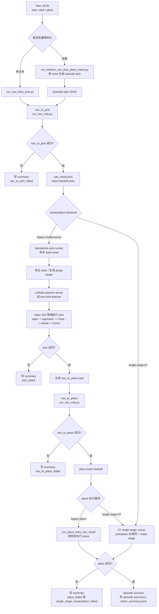

# Go2-X5 Navigation and Catch Pipeline

当前阶段目标为实现Isaac Sim 中的 Go2-X5 固定底座抓取 demo，主要流程如下：

```text
Isaac Sim 当前 stage
-> 导出机器人状态和局部环境碰撞体
-> 根据当前选中的物体 bbox 生成抓取目标
-> 外部 cuRobo Python 进程规划机械臂轨迹
-> Isaac Sim 执行开夹爪、接近、抓取、回到home position
```

当前 demo 以 Go2-X5 上的 X5 六轴机械臂和双指夹爪为对象。cuRobo 规划器使用仅包含机械臂的模型进行规划 `arm_joint1` 到 `arm_joint6`，Isaac Sim 仿真中则依旧执行完整Go2-X5 articulation。

导航抓取集成采用两阶段运行：Isaac Lab + RSL-RL 负责导航到可抓取
base pose，Isaac Sim GUI 负责恢复导航结果并调用现有抓取链路。cuRobo
继续运行在外部 Python 进程，避免和 Isaac Sim 的 Warp/CUDA 依赖冲突。

详细设计与数据格式：

- `docs/nav_manip_integration_plan.md`
- `docs/nav_pick_data_format.md`

## 当前 Pipeline 总览

当前代码主要保留两条执行路径：

1. 单任务导航抓取入口：`scripts/pipeline/run_nav_then_pick.py`
   - 输入一个 task JSON；
   - 在 Isaac Lab 中运行 `run_nav_only.py`，用 A* + DWA + RSL-RL policy 导航到 pick base goal；
   - 导航成功后启动 standalone Isaac Sim 抓取 runner；
   - 抓取 runner 恢复导航 handoff pose，导出当前机器人/物体状态，调用 cuRobo planner server 或 one-shot planner；
   - Isaac Sim 按物理关节控制执行开夹爪、接近、闭合、retreat/return-home，并写出 handoff report。

2. 批量 nav-pick-place 入口：`scripts/pipeline/run_random_nav_pick_place_batch.py`
   - 按 seed 生成随机化 pick/place task；
   - 对每个 episode 依次运行 nav-to-pick、pick、nav-to-place、place；
   - 支持 legacy multiprocess 和 `single-stage-07` manipulation backend；
   - 每个阶段失败都会写入 episode summary，batch 末尾汇总成功率和失败原因。

核心设计取舍：

- 导航阶段由 Isaac Lab + RSL-RL locomotion policy 推进；
- 机械臂规划由 cuRobo 完成，优先复用常驻 `grasp_planner_server.py` 降低初始化开销；
- 抓取/放置执行仍由 Isaac Sim 中的 articulation、drive、碰撞、摩擦和重力完成；
- batch 层只负责生成 task、启动子流程、收集 summary，不直接修改物理结果。



## 导航抓取快速入口

先使用 Isaac Lab 导出导航地图：

```bash
/path/to/IsaacLab/isaaclab.sh -p scripts/navigation/export_nav_map.py \
  --map source/scene/839920_go2_x5.usd \
  --output-dir source/scene/nav_maps/839920
```

纯 Python 检查 A* 和 DWA：

```bash
python scripts/navigation/visualize_astar_dwa.py \
  --map source/scene/nav_maps/839920/map.json \
  --start X Y \
  --start-yaw YAW \
  --goal X Y \
  --inflate-radius 0.40 \
  --local-clearance-radius 0.35
```

`tasks/nav_smoke_example.json` 是室内安全短路径，只用于验证 locomotion。
`tasks/nav_pick_example.json` 是苹果抓取候选任务。不要复用旧的
`/tmp/go2_x5_nav_result.json`：handoff 会拒绝贴近障碍或地图边界的历史 pose。

运行真实室内导航前必须挂载 SAGE-3D 数据盘。当前 839920 场景依赖：

```text
/mnt/sage_data/sage3d/single_scene/839920/collision/839920/839920_collision.usd
/mnt/sage_data/sage3d/single_scene/839920/usdz/839920.usdz
```

`run_nav_only.py` 会在创建环境前检查 `/World/scene_collision` 是否真正加载到
mesh。若数据盘未挂载，它会提前报错；不要继续调试 DWA 路径。

运行一键导航 + 抓取。若已迁移 DWA checkpoint 到
`checkpoints/go2_x5/flat/model_8500.pt`，可以不传 `--checkpoint`；也可以用
`GO2_X5_CHECKPOINT` 或显式 `--checkpoint` 覆盖。

```bash
export GO2_X5_CHECKPOINT=checkpoints/go2_x5/flat/model_8500.pt
test -f "$GO2_X5_CHECKPOINT"

/data/conda_envs/isaacsim51_3dgs_grasp/bin/python scripts/pipeline/run_nav_then_pick.py \
  --task-json tasks/nav_pick_example.json \
  --task RobotLab-Isaac-Velocity-Flat-Go2-X5-Foundation-v0 \
  --checkpoint "$GO2_X5_CHECKPOINT" \
  --isaaclab-launcher /home/light/workspace/IsaacLab/isaaclab.sh
```

默认流程会先在 Isaac Lab 中从 `tasks/nav_pick_example.json` 的远起点
`(-5.0, 0.0, 0.0)` 导航到苹果抓取 base goal，然后自动启动 headless Isaac
Sim standalone 抓取 runner，读取 `/tmp/go2_x5_nav_result.json`，恢复底盘
pose，调用外部 cuRobo one-shot planner，并写入 episode。若只想验证导航，
传 `--nav-only`；若想回到 Script Editor 手动 handoff，传 `--manual-grasp`。

`GO2_X5_CHECKPOINT` 必须指向 Go2-X5 RSL-RL locomotion checkpoint。当前本地
默认路径是 `checkpoints/go2_x5/flat/model_8500.pt`。文档中的占位符不能原样
执行；其他任务的 `.pt` 文件，例如 cartpole checkpoint，动作和观测维度不匹配，
也不能复用。checkpoint 文件被 `*.pt` 忽略，不要提交到 git。

Isaac Lab 导航窗口的 GUI 视角和 Isaac Sim 抓取 Script Editor 不同，不会自动
聚焦机器人。导航脚本默认开启 `--follow-camera`，把 viewport camera 放在
机器狗后上方；`--head-camera` 只是机器人前视传感器，用于保存图片数据，不会
改变 GUI 视角。若需要调远、关闭 GUI 跟随，或只设置一次固定总览视角，可使用：

```bash
--follow-camera-distance 2.0 --follow-camera-height 0.7
# 或
--follow-camera-mode fixed \
  --fixed-camera-preset start \
  --fixed-camera-close-distance 2.2 \
  --fixed-camera-close-height 1.35 \
  --fixed-camera-close-side -0.75
# 或
--no-follow-camera
```

`run_nav_only.py` 会生成一个临时 USDA wrapper，只把
`/World/scene_collision` 引用为 terrain。默认不额外叠加地面，这与参考
DWA 的 `play_nav_cs.py` 一致。只有确认 collision subtree 不包含可行走地面
时，才使用 `--add-nav-ground --ground-height Z` 添加独立平面。
使用 `--flat-terrain --debug-command 0.3 0 0` 可以单独验证 checkpoint、
腿部 PD 和 locomotion policy。默认保留 Isaac Lab sky light，便于可视化和
head-camera 调试；需要复现无光照设置时再传 `--disable-sky-light`。

导航阶段默认只加载 collision terrain，因此 GUI 里会看到灰色碰撞场景。这是
为了让 locomotion 调试和 episode 采集更轻量。若要像 cuRobo 抓取窗口那样
显示真实 3DGS 背景，可额外加：

```bash
--demo-visuals
```

`--demo-visuals` 会为导航阶段加载 `--visual-prim-path /World/gauss`，把 viewport
相机设置到固定总览位姿，减少走廊墙体遮挡，并让后续 grasp standalone runner
以可视 GUI 模式打开完整 USD。固定相机只在启动后设置一次，之后可以在 Isaac Sim
窗口中自由拖动视角；若显式使用 `--follow-camera-mode chase/front/overhead`，
脚本会每步继续更新相机。导航的 3DGS overlay 默认使用
`--visual-load-mode reference`，通过 Isaac Lab scene 配置加载可视层，避免在
PhysX tensor view 创建后修改 stage。若需要检查完整 SAGE root-level 渲染设置，
可显式传 `--visual-load-mode sublayer`；该模式会在 Isaac Lab 创建环境前预加载
完整 scene sublayer。苹果会在 grasp stage 打开完整 `scene_usd` 时出现。
`--demo-visuals` 默认使用靠近起点机器狗的固定机位；若想看完整路径，可传
`--fixed-camera-preset route`。
3DGS 可视化会增加渲染开销；调路线和速度时建议先不用
`--head-camera`，并加 `--no-record`：

```bash
/data/conda_envs/isaacsim51_3dgs_grasp/bin/python scripts/pipeline/run_nav_then_pick.py \
  --task-json tasks/nav_pick_example.json \
  --task RobotLab-Isaac-Velocity-Flat-Go2-X5-Foundation-v0 \
  --checkpoint "$GO2_X5_CHECKPOINT" \
  --isaaclab-launcher /path/to/IsaacLab/isaaclab.sh \
  --nav-only \
  --no-record
```

如果仿真里的机器狗本身走得慢，而不是 GUI FPS 慢，可以打开更激进的 DWA 速度
profile：

```bash
--brisk-nav
```

`--brisk-nav` 会把 DWA 巡航速度上限提高到至少 `0.70m/s`，提高 active forward
velocity、速度打分和线加速度上限；靠近抓取 base goal 时仍会降速。若需要手动
调速度，可使用：

```bash
--max-lin-vel 0.70 \
--min-active-lin-vel 0.45 \
--speed-bias 0.80 \
--max-linear-accel 3.5 \
--close-goal-speed-limit 0.30
```

这里的 `--max-lin-vel` 是 DWA 给 locomotion policy 的速度上限。真实 GUI
运行慢通常有两层原因：一是仿真内策略实际速度会因窄通道 clearance 降速；
二是墙钟时间会被 GUI、camera sensor、图片编码和 CSV 写盘拖慢。若只想验证
路径是否能跑通，先关闭 `--head-camera` 和记录；需要演示效果时再打开
`--load-visual-scene` 和相机采集。
终点 yaw 对齐阶段使用 `--yaw-align-max-wz` 和 `--yaw-align-min-wz` 控制旋转
命令强度，并用很小的 `--yaw-align-vx` 激活步态。进入目标位置容差后，脚本会
继续做 yaw-hold settle，避免纯零速度 settle 让 yaw 回弹。
`--yaw-align-activation-yaw-error` 默认是 `0.0`，表示只要 yaw 还没有进入容差，
就持续保留这条小前进命令；否则 Go2-X5 policy 容易在最后 `0.2 rad` 左右变成
站立不转。

地图膨胀会把地图边界视为不可通行区域。导航 settle 后会再次检查目标距离，
handoff 瞬移前也会检查任务 goal 是否匹配、占用栅格、`0.25 m` clearance
和地图边界距离。
地图导出会保守栅格化碰撞三角形的边线，避免垂直墙在俯视 XY 投影中退化为
零面积后消失。修改地图导出逻辑或碰撞 USD 后，必须重新生成
`occupancy.pgm` 和 `map.json`，再重新运行纯 Python 可视化与真实导航。
真实导航若大部分时间持续收到前进命令但底盘位移不足，会自动以
`nav_collision` 结束，不再因为偶发低速命令而无限原地踏步。调试日志中的
`stall_window=(samples, max_displacement, forward_command_ratio)` 用于定位
物理碰撞或 terrain 接触异常。DWA 候选轨迹进入目标容差后会停止向前预测，
避免抓取 base goal 后方的桌子或墙错误拒绝本来可达的接近命令。日志中的
`dwa=(clearance, feasible, collision_rej, target)` 和
`contact=(foot, nonfoot)` 用于区分局部规划拒绝、足端接触和非足端碰撞。
苹果任务包含狭窄转弯，默认使用 `--inflate-radius 0.25`、
`--local-clearance-radius 0.20`、`--lookahead-distance 0.35` 和
`--prediction-horizon 0.90`。DWA 内部预测采样周期不会大于 locomotion control dt，
避免轨迹跨过中间占用栅格却未检查。
handoff 只继承导航的 `x/y/yaw`，使用抓取场景中稳定的 root `z`，避免把
行走 rollout 中的瞬时 roll/pitch 带入抓取场景。

默认抓取阶段使用 headless standalone runner，因此不会产生 Script Editor 长任务
期间常见的 GUI asyncio 噪声。抓取成功标准也已收紧：默认要求
`object_lift_success=true` 才算 episode 成功；旧的 side retreat 位移成功只作为
调试指标保留。需要临时回到旧标准时传 `--allow-retreat-success`。

若使用 `--manual-grasp`，导航成功后可以在 Isaac Sim Script Editor 中运行
coordinator 打印的 handoff 命令。该命令读取 `/tmp/go2_x5_nav_result.json`，
恢复底盘 pose，等待底盘稳定，然后调用新的 `GraspPipeline` 包装层。

Script Editor 中应使用带文件名的 `compile(...)` 写法，确保 handoff
脚本可以从 `__file__` 推导仓库根目录并导入 `source.data`：

```python
_script = "/home/light/workspace/arm_vla/scripts/isaac/run_pick_from_nav_result.py"
exec(
    compile(open(_script, "r", encoding="utf-8").read(), _script, "exec"),
    {"__file__": _script, "__name__": "__main__"},
)
```

## 一、当前进度

已经完成：

- 完整 Go2-X5 articulation 中机械臂、夹爪 DOF 映射和 TCP frame 对齐
- 从 Isaac Sim 导出当前 arm state、`T_world_base`、`T_base_tcp` 和局部环境碰撞体
- 从 Stage 当前选中的物体生成基于 bbox 的抓取目标，当前默认优先侧向抓取
- 用 cuRobo 规划 `pregrasp -> grasp` 轨迹，并把 Isaac 导出的附近碰撞体近似成 cuRobo cuboid scene
- 在 Isaac Sim 中执行夹爪开闭、轨迹跟踪、抓取后退回和结果判定
- cuRobo one-shot 子进程规划和可选常驻 planner server 两种运行方式
- 用当前场景验证抓取闭环，夹爪能否真正抓起物体仍依赖 USD 中正确保存的 drive stiffness、damping、max force 和物体碰撞/刚体参数

长期目标：

- 目标物体需要在 Isaac Sim Stage 中手动选中，后期需要自动化
- 当前只规划固定底座上的机械臂，后续需要规划 Go2 行走和四足底盘协同
- 环境避障使用局部 collision AABB 的 cuboid 近似，后期可以考虑替换为完整 mesh-to-collision-world 转换
- 后续自动化后开始批量采集数据，并确定数据集格式

## 二、环境依赖

### 环境分层

本项目明确拆成两个 Python 环境，避免把 LeRobot/Rerun 依赖装进 Isaac Sim
环境后破坏 Isaac Sim 5.1 的 ABI 和依赖约束。

| 环境 | 本机路径 | 职责 | 说明 |
| ---- | -------- | ---- | ---- |
| Isaac Sim / Isaac Lab 运行环境 | `/data/conda_envs/isaacsim51_3dgs_grasp` | full-physics pipeline、IsaacLab runtime、cuRobo 规划 server、仿真采集 | 不安装 `lerobot` / `rerun-sdk` |
| LeRobot / Rerun 转换环境 | `/data/conda_envs/lerobot_rerun` | LeRobot v2 数据检查、`.rrd` 可视化导出 | 不 import `omni`、`isaacsim`、`pxr` |

### Isaac Sim 环境版本

该环境已经包含 Isaac Sim 5.1、Isaac Lab、RobotLab 任务、RSL-RL policy 和
cuRobo 规划依赖。以下版本来自当前可运行环境，用于复现或排查依赖漂移。

| Package | Version | 用途 |
| ------- | ------- | ---- |
| Python | `3.11.15` | Isaac Sim 5.1 当前环境 Python |
| `isaacsim` | `5.1.0.0` | Isaac Sim Kit / runtime |
| `isaacsim-core` | `5.1.0.0` | Isaac Sim core API |
| `isaacsim-kernel` | `5.1.0.0` | Isaac Sim kernel 依赖 |
| `isaaclab` | `0.54.3` | Isaac Lab runtime |
| `isaaclab-rl` | `0.4.7` | Isaac Lab RL wrapper |
| `rsl-rl-lib` | `3.1.2` | Go2-X5 locomotion policy runner |
| `rl-games` | `1.6.1` | Isaac Lab 依赖 |
| `nvidia-curobo` | `0.0.0` | cuRobo planner |
| `warp-lang` | `1.13.0` | cuRobo / NVIDIA Warp |
| `torch` | `2.7.0+cu128` | CUDA tensor / policy / planner |
| `torchvision` | `0.22.0+cu128` | 图像工具 |
| `torchaudio` | `2.7.0+cu128` | torch 环境配套包 |
| `numpy` | `1.26.0` | Isaac Sim 兼容 NumPy |
| `scipy` | `1.15.3` | 数值工具 |
| `packaging` | `23.0` | Isaac Sim 版本约束 |
| `psutil` | `5.9.8` | Isaac Sim kernel 版本约束 |
| `websockets` | `12.0` | Isaac Sim kernel 版本约束 |
| `pillow` | `11.3.0` | 图像保存 |
| `opencv-python-headless` | `4.11.0.86` | MP4 编码和帧处理 |
| `pyarrow` | `24.0.0` | LeRobot parquet 物化 |
| `pandas` | `3.0.3` | 表格处理 |
| `tqdm` | `4.67.3` | 进度条 |
| `imageio` | `2.37.0` | 视频/图像 I/O |
| `imageio-ffmpeg` | `0.6.0` | ffmpeg 后端 |
| `gymnasium` | `1.2.1` | Isaac Lab env API |
| `hydra-core` | `1.3.2` | Isaac Lab 配置 |
| `omegaconf` | `2.3.0` | Hydra 配置 |
| `trimesh` | `4.5.1` | mesh / collision 诊断 |
| `networkx` | `3.3` | 图搜索辅助 |
| `matplotlib` | `3.10.3` | debug 可视化 |

不要在该环境执行：

```bash
/data/conda_envs/isaacsim51_3dgs_grasp/bin/python -m pip install lerobot rerun-sdk
```

如需锁定普通 pip package，可使用：

```bash
cd /home/light/workspace/arm_vla_full_physics

/data/conda_envs/isaacsim51_3dgs_grasp/bin/python -m pip install \
  -r requirements/isaacsim51_runtime.txt
```

离线下载 wheel：

```bash
mkdir -p /tmp/wheelhouse_isaacsim51

/data/conda_envs/isaacsim51_3dgs_grasp/bin/python -m pip download \
  -r requirements/isaacsim51_runtime.txt \
  -d /tmp/wheelhouse_isaacsim51
```

### LeRobot / Rerun 环境版本

该环境只用于数据集转换、检查和 Rerun 可视化，不运行 Isaac Sim。

| Package | Version | 用途 |
| ------- | ------- | ---- |
| Python | `3.10.20` | LeRobot/Rerun 普通 Python 环境 |
| `lerobot` | `0.4.4` | LeRobot v2 dataset API |
| `rerun-sdk` | `0.26.2` | `.rrd` 可视化记录 |
| `numpy` | `2.2.6` | 数组处理 |
| `pandas` | `2.3.3` | parquet / metadata 检查 |
| `pyarrow` | `24.0.0` | LeRobot parquet 读取 |
| `pillow` | `12.2.0` | 图片读取 |
| `opencv-python` | `4.13.0.92` | 视频帧处理 |
| `tqdm` | `4.68.2` | 转换进度 |
| `imageio` | `2.37.3` | 视频/图像 I/O |
| `imageio-ffmpeg` | `0.6.0` | ffmpeg 后端 |
| `torch` | `2.10.0+cu128` | LeRobot tensor 数据 |
| `torchvision` | `0.25.0+cu128` | 图像 tensor 工具 |
| `pyyaml` | `6.0.3` | metadata 配置 |
| `huggingface-hub` | `0.35.3` | LeRobot/HF 数据集工具 |
| `datasets` | `4.8.5` | HF dataset 工具 |
| `safetensors` | `0.8.0` | torch/模型数据依赖 |
| `av` | `15.1.0` | 视频解码依赖 |
| `packaging` | `25.0` | 版本解析 |

安装或复现：

```bash
cd /home/light/workspace/arm_vla_full_physics

/data/conda_envs/lerobot_rerun/bin/python -m pip install \
  -r requirements/lerobot_rerun.txt
```

离线下载 wheel：

```bash
mkdir -p /tmp/wheelhouse_lerobot_rerun

/data/conda_envs/lerobot_rerun/bin/python -m pip download \
  -r requirements/lerobot_rerun.txt \
  -d /tmp/wheelhouse_lerobot_rerun
```

### cuRobo 准备

full-physics 模式默认会自动启动或复用 `scripts/curobo/grasp_planner_server.py`。
规划环境需要满足：

- 能导入当前环境中的 `nvidia-curobo`；
- `torch.cuda.is_available()` 为 `True`；
- 能加载 `source/robot/go2_x5/curobo/go2_x5_arm.yml`；
- 能读取 arm-only URDF 和 mesh assets；
- 能调用 `curobo.motion_planner.MotionPlanner`。

检查命令：

```bash
cd /home/light/workspace/arm_vla_full_physics

/data/conda_envs/isaacsim51_3dgs_grasp/bin/python - <<'PY'
import torch
print("torch", torch.__version__, "cuda", torch.version.cuda)
print("cuda_available", torch.cuda.is_available())
import curobo
print("curobo import ok", curobo.__file__)
PY
```

## 三、文件结构

### 主流程脚本

最终 demo 只依赖以下顺序链：


| 顺序 | 文件                                         | 运行位置                | 职责                                                                                                                               |
| ---- | -------------------------------------------- | ----------------------- | ---------------------------------------------------------------------------------------------------------------------------------- |
| 01   | `scripts/isaac/01_export_go2_x5_state.py`    | Isaac Sim Script Editor | 自动解析当前 Go2-X5 articulation root，导出 arm/gripper DOF、TCP pose、附近环境 collision cuboids 到`/tmp/go2_x5_isaac_state.json` |
| 02   | `scripts/isaac/02_generate_grasp_target.py`  | Isaac Sim Script Editor | 读取当前选中物体 bbox 和 step 01 的 base pose，生成 side/top-down grasp target 到`/tmp/go2_x5_target_tcp_pose.json`                |
| 03   | `scripts/curobo/03_plan_grasp_trajectory.py` | 外部 Python             | 读取 state 和 target JSON，加载 cuRobo arm model，规划抓取轨迹到`/tmp/go2_x5_grasp_plan.json`                                      |
| 04   | `scripts/isaac/04_execute_grasp_sequence.py` | Isaac Sim Script Editor | 在完整 articulation 上执行 grasp plan，控制机械臂和夹爪，输出`/tmp/go2_x5_grasp_sequence_result.json`                              |
| 05   | `scripts/isaac/05_run_pick_retreat_demo.py`  | Isaac Sim Script Editor | 一键串联 step 01 到 step 04，优先开启grasp_planner_server，输出`/tmp/go2_x5_task_result.json`，以在长期运行环境下加速规划          |

辅助主流程文件：


| 文件                                     | 职责                                                                                               |
| ---------------------------------------- | -------------------------------------------------------------------------------------------------- |
| `scripts/curobo/grasp_planner_server.py` | 可选常驻 cuRobo planner service，监听 localhost，减少重复启动 Python 和初始化 MotionPlanner 的开销 |
| `scripts/math/SE3.py`                    | Isaac 脚本和普通 Python 脚本共用的 SE(3)、四元数、pose 变换工具                                    |
|                                          |                                                                                                    |

### 开发与诊断脚本

最终 demo 不直接依赖这些脚本，它们保留在 `scripts/dev_tools/`：


| 文件                                                     | 职责                                                              |
| -------------------------------------------------------- | ----------------------------------------------------------------- |
| `scripts/dev_tools/isaac/inspect_go2_x5_articulation.py` | 检查 articulation root、完整 DOF order、arm/gripper joint mapping |
| `scripts/dev_tools/isaac/inspect_gripper_tcp.py`         | 检查夹爪和 TCP frame，导出 TCP 候选信息                           |
| `scripts/dev_tools/isaac/demo_gripper_control.py`        | 单独测试双指夹爪开闭控制                                          |
| `scripts/dev_tools/curobo/make_go2_x5_arm_urdf.py`       | 从完整 Go2-X5 URDF 派生 cuRobo arm-only URDF                      |
| `scripts/dev_tools/curobo/build_go2_x5_curobo_model.py`  | 包装 cuRobo builder，生成 arm model yml/xrdf                      |
| `scripts/dev_tools/curobo/check_go2_x5_curobo_model.py`  | 检查 cuRobo yml、joint names、tool frame、FK、collision spheres   |
| `scripts/dev_tools/curobo/check_isaac_curobo_fk.py`      | 对比同一 q 下 Isaac TCP pose 和 cuRobo FK                         |
| `scripts/dev_tools/curobo/demo_plan_to_pose.py`          | 单个 TCP target 的 cuRobo planning smoke test                     |
| `scripts/dev_tools/curobo/demo_track_trajectory.py`      | 早期单条轨迹在 Isaac 中的跟踪 demo                                |

### 机器人、场景与历史目录


| 路径                                                                  | 职责                                                              |
| --------------------------------------------------------------------- | ----------------------------------------------------------------- |
| `source/robot/go2_x5/urdf/go2_x5.urdf`                                | 完整 Go2-X5 原始 URDF                                             |
| `source/robot/go2_x5/curobo/go2_x5_arm.urdf`                          | cuRobo 规划使用的 arm-only URDF                                   |
| `source/robot/go2_x5/curobo/go2_x5_arm.yml`                           | 当前 cuRobo MotionPlanner 加载的机器人配置                        |
| `source/robot/go2_x5/curobo/go2_x5_arm.xrdf`                          | 同一 arm model 的 XRDF 描述                                       |
| `source/robot/go2_x5/meshes/`                                         | Go2-X5 和 X5 机械臂 mesh assets                                   |
| `source/robot/go2_x5/urdf/go2_x5/`                                    | Isaac Sim 导入后的 Go2-X5 USD package 和 physics/sensor/base 配置 |
| `source/scene/839920_go2_x5.usd`                                      | 当前主要 Isaac Sim 场景入口之一                                   |
| `source/scene/apple/`、`source/scene/orange/`、`source/scene/bottle/` | 物体 USD、纹理和 annotation assets                                |
|                                                                       |                                                                   |

场景里的纹理、物体 annotation、STL/DAE mesh 属于数据资产，不在 README中逐个列出。下面列出仍然保留在仓库中的代码和说明文件。

## 四、运行完整 demo

### 1. 准备 Isaac Sim 场景

1. 在 Isaac Sim GUI 中打开目标 USD stage，例如 `source/scene/839920_go2_x5.usd`
2. 确认 stage 中存在 Go2-X5 articulation，当前主流程会扫描
   `UsdPhysics.ArticulationRootAPI` 并自动解析 `/World/go2_x5.../root_joint
3. 固定底座或保证底盘不会在抓取过程中漂移
4. 确认夹爪 drive 参数已经写入 USD。夹爪没有足够 stiffness/max force 时，日志可能显示闭合，但物体不会被真正夹起
5. 确认目标物体有合理的 collider 和 rigid body 物理属性。
6. 在 Stage 面板中选中要抓取的物体 prim

### 2. 可选：启动常驻 planner

常驻 planner 不是必须的。未启动时 step 05 会回退到 one-shot cuRobo
子进程。常驻模式主要减少 planner 初始化开销；单次复杂规划本身仍需要时间。

在普通终端运行：

```bash
cd /home/light/workspace/arm_vla

/data/conda_envs/isaacsim51_3dgs_grasp/bin/python \
  scripts/curobo/grasp_planner_server.py
```

默认监听：

```text
127.0.0.1:8765
```

### 3. 在 Isaac Sim Script Editor 运行一键 demo

推荐直接执行磁盘文件，避免 Script Editor 中残留旧粘贴代码：

```python
exec(open(
    "/home/light/workspace/arm_vla/scripts/isaac/05_run_pick_retreat_demo.py",
    "r",
    encoding="utf-8",
).read())
```

step 05 会依次执行：

```text
01 export state
02 generate grasp target
03 plan grasp trajectory
04 execute grasp sequence
05 write task summary
```

主要输出文件：


| 输出                                     | 含义                                                              |
| ---------------------------------------- | ----------------------------------------------------------------- |
| `/tmp/go2_x5_isaac_state.json`           | 当前 Isaac robot state、frame、local environment collision export |
| `/tmp/go2_x5_target_tcp_pose.json`       | 抓取目标、pregrasp、grasp、retreat/lift 相关 pose                 |
| `/tmp/go2_x5_grasp_plan.json`            | cuRobo 规划出的 segment 和 trajectory                             |
| `/tmp/go2_x5_grasp_sequence_result.json` | Isaac 执行结果、跟踪误差、物体位移                                |
| `/tmp/go2_x5_task_result.json`           | 一键任务汇总结果                                                  |

成功时终端日志应同时看到：

- state dump 成功识别当前 Go2-X5 articulation root
- target JSON 中的 `grasp_mode` 已验证
- cuRobo `all_motion_segments_success: true`
- Isaac 执行 summary 中 task success 为真

### 4. 分步运行

调试时可以按编号拆开运行。

Isaac Sim Script Editor：

```python
exec(open("/home/light/workspace/arm_vla/scripts/isaac/01_export_go2_x5_state.py", "r", encoding="utf-8").read())
exec(open("/home/light/workspace/arm_vla/scripts/isaac/02_generate_grasp_target.py", "r", encoding="utf-8").read())
```

普通终端：

```bash
cd /home/light/workspace/arm_vla

/data/conda_envs/isaacsim51_3dgs_grasp/bin/python \
  scripts/curobo/03_plan_grasp_trajectory.py
```

Isaac Sim Script Editor：

```python
exec(open("/home/light/workspace/arm_vla/scripts/isaac/04_execute_grasp_sequence.py", "r", encoding="utf-8").read())
```

## 运行注意项

- `01_export_go2_x5_state.py` 会把附近 collision prim 的 world AABB 转成局部 cuboid障碍物给 cuRobo。过滤规则在脚本顶部配置；如果场景 obstacle 过大、过远或命名被排除，它不会进入规划 world
- side grasp 当前优先用于桌面较高的场景。side grasp 关闭夹爪后默认沿接近轨迹原路退出，不再额外执行一次竖直 lift
- cuRobo 规划成功不等于 Isaac 执行成功。关节跟踪误差、夹爪 drive、物体 collider、桌面碰撞和仿真帧率都会影响最终抓取

## 推荐排查顺序

1. 先运行 `scripts/dev_tools/isaac/inspect_go2_x5_articulation.py`，确认 robot root、
   articulation root 和 arm/gripper DOF mapping。
2. 单独运行 `scripts/dev_tools/isaac/demo_gripper_control.py`，确认夹爪能稳定开闭且有足够夹持力
3. 运行 step 01 和 `check_isaac_curobo_fk.py`，确认 Isaac 和 cuRobo TCP 对齐
4. 查看 step 02 打印的 grasp target 是否在 `arm_base_link` 可达范围内
5. 查看 step 03 是否加载了期望数量的 world collision cuboids，并确认不是被过粗的AABB 障碍物挡死
6. 查看 step 04 的 joint tracking error、gripper close progress 和物体 bbox 位移
