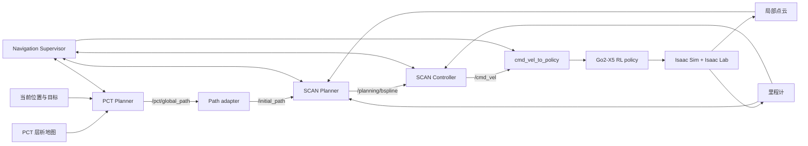

# PCT + SCAN: Go2-X5 四足移动操作导航

这个分支把项目原来的 PCT + DWA 导航链改成了 PCT + SCAN。PCT Planner 负责跨楼层全局选路，SCAN Planner 根据局部点云持续优化三维轨迹，闭环控制器再把轨迹转换为 Go2-X5 强化学习步态策略可执行的速度命令。

导航直接运行在现有 Isaac Sim + Isaac Lab 移动操作 pipeline 中，后续的抓取、携物、放置和 LeRobot 数据导出也保留在同一条流程里。这不是另建的一套规划演示。

目前静态多楼层场景已经跑通 PCT 全局路径、SCAN 局部规划、RL locomotion、抓放和数据导出。楼梯段采用已经确认的工程方案：进入楼梯区间后冻结底盘并完成楼层交接。因此当前结果可用于稳定的跨楼层移动操作验证，但不能算作纯物理爬楼。移动推车在线绕障和 live PCT 全局重规划仍是后续验收项。

## PCT 和 SCAN 各自负责什么

PCT 是全局规划器，SCAN 是局部规划器，两者职责没有重叠。

- PCT Planner 读取层析地图、机器人当前位置和目标位置，决定走哪一层、经过哪段楼梯，并发布完整的三维全局路径。
- SCAN Planner 读取 PCT 路径、机器人里程计和在线点云，只处理机器人附近的轨迹平滑、碰撞约束和局部重规划。
- SCAN Controller 跟踪 B-spline，输出机体坐标系下的 `vx`、`vy` 和 `wz`。
- `cmd_vel_to_policy` 是唯一写入 RL policy command buffer 的入口。
- Navigation Supervisor 管理超时停车、规划失败、重规划、楼梯交接和目标到达。

生产配置使用固定来源的官方 PCT Planner `OfflineElePlanner` native A*。ROS 2 adapter 只统一坐标、地面高度语义、Path 消息和楼梯区间。全局路线仍由 PCT Planner 生成，SCAN 不会自行改写跨楼层选择。

## 为什么这里用 SCAN 代替 DWA

原来的 PCT + DWA 和现在的 PCT + SCAN 都可以让 PCT 决定全局路线。主要差别出现在局部执行阶段。

| 关注点 | 原 PCT + DWA 基线 | 当前 PCT + SCAN 主线 |
| --- | --- | --- |
| 局部规划对象 | 在二维代价地图上采样短时速度 | 在局部三维占据地图中优化连续 B-spline |
| 高度信息 | 主要按平面导航处理，坡面和楼层交接依赖额外逻辑 | 保留 PCT Path 的高度变化，并在三维空间内检查轨迹 |
| 机器人包络 | 以二维 footprint 和平面膨胀为主 | 用双圆柱近似 Go2-X5 携臂外形，并分别处理上下方向膨胀 |
| 控制连续性 | 每个周期选择一组局部速度 | 先生成带时间信息的轨迹，再由控制器连续跟踪 |
| 与全局路径的关系 | 围绕当前速度窗口评分，主要关注短时可行性 | 按 PCT 路径顺序推进，只在滚动窗口内调整轨迹 |
| 动力学约束 | 主要在速度采样和评分阶段限制 | 在轨迹优化和控制阶段同时检查速度、加速度和偏航能力 |

这些差异让 SCAN 更适合本项目中的四足机器人：地面高度不是附加信息，携带机械臂后的碰撞包络也不能只靠平面 footprint 表达；连续轨迹经过控制器限幅后，传给 RL policy 的命令也更容易保持平稳。

本分支还在 SCAN 外层加入了 supervisor、输入超时、轨迹身份校验、持续零速停车和唯一 policy 写入器。这些属于本项目的集成设计，不是 SCAN 算法本身的特性。

README 重点介绍的是三维轨迹、携臂包络和闭环安全行为。是否缩短完整任务时间，还取决于绕行、停顿、重规划和目标收敛。SCAN 的局部优化通常也比一次简单的 DWA 采样更重。仓库尚未用完全相同的全局路径、速度上限和场景条件完成公平对照，因此目前不作 SCAN 耗时已经超过 DWA 的结论。

## 在线运行链



主链只使用 ROS 2 消息通信，不依赖临时 JSON、文件轮询或进程标准输入输出传递在线导航状态。默认组合 launch 中没有 DWA fallback，也没有 `local_planner=dwa|scan` 开关。

### 主要 ROS 2 接口

| Topic | 消息类型 | 含义 |
| --- | --- | --- |
| `/pct/goal` | `geometry_msgs/msg/PoseStamped` | 发送给 PCT 的全局目标 |
| `/pct/global_path` | `nav_msgs/msg/Path` | PCT 生成的跨楼层三维路径 |
| `/initial_path` | `nav_msgs/msg/Path` | 经过统一语义适配的 SCAN 参考路径 |
| `/body_pose` | `nav_msgs/msg/Odometry` | Go2-X5 位姿和速度 |
| `/cloud_registered` | `sensor_msgs/msg/PointCloud2` | 过滤地面和机器人自身点后的局部点云 |
| `/planning/bspline` | `scan_planner_msgs/msg/Bspline` | SCAN 输出的局部轨迹 |
| `/cmd_vel` | `geometry_msgs/msg/Twist` | 发送给 locomotion policy 的机体速度 |
| `/navigation/status` | `scan_planner_msgs/msg/NavigationStatus` | 规划、跟踪、停车和到达状态 |

所有仿真节点使用仿真时钟。Path 使用 reliable QoS，必要时保持 transient local；里程计和点云使用 SensorData QoS。Topic、frame 和 QoS 都由参数文件或 launch 参数控制。

## 当前验收边界

| 项目 | 当前状态 |
| --- | --- |
| 官方 PCT backend 生成多楼层三维 Path | 已验证 |
| PCT Path -> SCAN -> B-spline -> cmd_vel -> RL policy | 已验证 |
| 静态场景跨楼层携物导航和到达后停车 | 已完成多种子重复验证 |
| 导航、抓取、携物、放置和 LeRobot 导出 | 已完成完整 pipeline 实测 |
| 楼梯段 | 使用底盘冻结和楼层交接，不是纯物理爬楼 |
| 移动推车在线绕障 | 尚未列入发布验收 |
| 障碍阻断后触发 live PCT 全局重规划 | 尚未列入发布验收 |
| 与 DWA 的同条件耗时对照 | 未形成可发布结论 |

这个表是当前代码的发布口径。更早的阶段实验、调参记录和问题复盘保存在 `project.json` 与 `docs/`，不再堆放在根 README 中。

## 仓库结构

```text
ros2_ws/src/
├── pct_ros2_adapter/          # 官方 PCT backend、坐标转换和 Path 发布
├── scan_planner/              # 三维局部地图、搜索和 B-spline 优化
├── scan_controller/           # B-spline 闭环跟踪与 cmd_vel 输出
├── navigation_supervisor/     # 导航状态机、超时和安全停车
├── isaac_navigation_bridge/   # Isaac topic 归一化与组合 launch
├── scan_planner_msgs/         # Path 之外的项目消息
└── navigation_visualization/  # 规划状态可视化工具

source/navigation/             # cmd_vel 到 RL policy 的运行时连接
scripts/navigation/            # PCT 资产、探针和 live 验收工具
scripts/pipeline/              # nav-pick-place 与数据导出入口
configs/navigation/            # 跨楼层地图和楼梯语义配置
configs/scenes/                # 场景 profile
tasks/                         # 导航和移动操作任务
docs/                          # 设计、调参和验收说明
```

## 环境准备

### 系统要求

当前环境基于 Ubuntu、ROS 2 Humble、Python 3.11、Isaac Sim 5.1、Isaac Lab 2.3.x 和支持 CUDA 的 NVIDIA GPU。ROS 2 节点使用系统 Python，Isaac 运行时使用独立 conda 环境。两个 Python ABI 不应混用。

先获取分支：

```bash
git clone --branch pct-scan --single-branch \
  https://github.com/yagami-light7/arm-vla-grasp-sim.git \
  pct_scan
cd pct_scan
```

创建 Isaac 环境：

```bash
conda create -n isaac_locomani python=3.11 -y
conda activate isaac_locomani

python -m pip install --upgrade pip
python -m pip install "isaacsim[all,extscache]==5.1.0" \
  --extra-index-url https://pypi.nvidia.com

git clone https://github.com/isaac-sim/IsaacLab.git ../IsaacLab
git -C ../IsaacLab checkout 2f91d7dd2994246505602526b32ac67ff758d472
../IsaacLab/isaaclab.sh -i

git clone https://github.com/NVlabs/curobo.git ../curobo
git -C ../curobo checkout 87260212b9ad5ebe486427cbf168611145232884
python -m pip install -e "../curobo[cu12]"

python -m pip install -r requirements/isaacsim51_runtime.txt

export ISAAC_PYTHON="$(command -v python)"
export PCT_SCENE_OUTPUT="${PCT_SCENE_OUTPUT:-$HOME/pct_scene_outputs}"
mkdir -p "$PCT_SCENE_OUTPUT"
```

确认关键包和 CUDA 可以加载：

```bash
"$ISAAC_PYTHON" -c \
  "import isaacsim, isaaclab, curobo, torch; print(torch.cuda.is_available())"
```

### 准备 PCT Planner

生产 backend 固定使用 [byangw/PCT_planner](https://github.com/byangw/PCT_planner) 的指定源码版本，并应用仓库内受跟踪的 native A* 补丁。`external/PCT_planner` 是运行时目录，不提交到 Git。

已有正确的本地 PCT 资产包时，把整个目录复制到：

```text
external/PCT_planner/
```

然后执行只读校验：

```bash
/usr/bin/python3 scripts/navigation/manage_pct_upstream.py verify-source \
  --manifest ros2_ws/src/pct_ros2_adapter/upstream/PCT_PLANNER_SOURCE.json \
  --source-root external/PCT_planner \
  --state patched \
  --allow-generated

/usr/bin/python3 scripts/navigation/manage_pct_upstream.py verify-binaries \
  --manifest ros2_ws/src/pct_ros2_adapter/upstream/PCT_PLANNER_SOURCE.json \
  --source-root external/PCT_planner
```

如果需要从上游源码重新准备和编译，请按 [PCT ROS 2 adapter 说明](ros2_ws/src/pct_ros2_adapter/README.md) 执行 `prepare`、`apply`、`build-plan` 和 `verify-binaries`。`build-plan` 只输出待审核的编译命令，不会自动执行。源码固定信息、补丁哈希和许可证见 [upstream NOTICE](ros2_ws/src/pct_ros2_adapter/upstream/NOTICE.md)。

### 准备场景和 checkpoint

大型场景、地图和 checkpoint 不在 Git 仓库中。把资产包复制到以下位置，并保留原目录结构：

| 本地资产 | 仓库内位置 |
| --- | --- |
| 良渚场景 | `source/scene/liangzhu/` |
| 多楼层别墅场景 | `source/scene/multifloor/` |
| 操作物体 | `source/scene/objects/` |
| Go2-X5 locomotion checkpoint | `checkpoints/go2_x5/pct_multifloor/` |

可以从已有 `pct_scene` worktree 复制这批资产。不要把 `*.pt`、`*.ply`、`*.pcd`、`*.usd`、`*.pickle` 或日志加入 Git。

检查 profile 和资产：

```bash
"$ISAAC_PYTHON" -B scripts/pipeline/run_full_physics_pipeline.py \
  --list-scene-profiles

"$ISAAC_PYTHON" -B scripts/pipeline/run_full_physics_pipeline.py \
  --scene-profile multi_floor \
  --check-scene-assets
```

## 构建 ROS 2 workspace

```zsh
cd ros2_ws
source /opt/ros/humble/setup.zsh
colcon build --symlink-install
source install/setup.zsh
```

验证正式 launch 能被 ROS 2 找到：

```zsh
ros2 launch isaac_navigation_bridge pct_scan_navigation.launch.py --show-args
```

正式入口属于 `isaac_navigation_bridge` 包。`scan_planner` 包中没有 `run.launch.py`，所以以下命令不会工作：

```text
ros2 launch scan_planner run.launch.py
```

## 运行 PCT + SCAN

### 推荐的独立导航验收

`run_pct_scan_live_acceptance.py` 会检查 GPU、统一调参文件、PCT 源码身份和空 ROS domain，然后启动正式 ROS 图与一个 Isaac episode。脚本结束时会清理自己启动的进程。输出目录必须原本不存在。

```zsh
conda activate isaac_locomani
cd /path/to/pct_scan

export ISAAC_PYTHON="$(command -v python)"
export PCT_SCENE_OUTPUT="${PCT_SCENE_OUTPUT:-$HOME/pct_scene_outputs}"
export ROS_DOMAIN_ID=189  # 示例值，运行前确认这个 domain 中没有旧节点
source /opt/ros/humble/setup.zsh
source ros2_ws/install/setup.zsh
unset PYTHONPATH

"$ISAAC_PYTHON" -B scripts/navigation/run_pct_scan_live_acceptance.py \
  --mode crossfloor_carry \
  --output-dir "$PCT_SCENE_OUTPUT/pct_scan_crossfloor_carry" \
  --ros-domain-id "$ROS_DOMAIN_ID" \
  --isaac-python "$ISAAC_PYTHON"
```

这个入口会自己启动 `pct_scan_navigation.launch.py`，运行它时不要在同一个 ROS domain 中另外启动组合 launch。可用验收模式包括：

- `flat_policy`: 同层 RL policy 导航。
- `static_stair`: 当前楼梯冻结方案的楼层交接。
- `crossfloor_carry`: 携物跨楼层导航。
- `dynamic_f1`: 移动障碍场景，当前属于后续研发验收。
- `dynamic_replan_f1`: 全局重规划场景，当前属于后续研发验收。

### 完整 nav-pick-place pipeline

完整移动操作流程使用两个终端。两边必须设置相同的空闲 `ROS_DOMAIN_ID` 和相同的 RMW 实现。

终端一启动 ROS 2 导航图：

```zsh
cd /path/to/pct_scan
export ROS_DOMAIN_ID=189  # 示例值，运行前确认这个 domain 中没有旧节点
export RMW_IMPLEMENTATION=rmw_fastrtps_cpp

source /opt/ros/humble/setup.zsh
source ros2_ws/install/setup.zsh

ros2 launch isaac_navigation_bridge pct_scan_navigation.launch.py
```

终端二启动 Isaac pipeline：

```zsh
conda activate isaac_locomani
cd /path/to/pct_scan

export ISAAC_PYTHON="$(command -v python)"
export ROS_DOMAIN_ID=189  # 必须与终端一相同
export RMW_IMPLEMENTATION=rmw_fastrtps_cpp
export PCT_SCENE_OUTPUT="${PCT_SCENE_OUTPUT:-$HOME/pct_scene_outputs}"

source /opt/ros/humble/setup.zsh
source ros2_ws/install/setup.zsh
unset PYTHONPATH

"$ISAAC_PYTHON" -B scripts/pipeline/run_full_physics_pipeline.py \
  --scene-profile multi_floor \
  --output-dir "$PCT_SCENE_OUTPUT/multi_floor_pct_scan" \
  --headless
```

去掉 `--headless` 并增加 `--no-headless --keep-window-open` 可以打开 GUI 并在任务结束后保留窗口：

```zsh
"$ISAAC_PYTHON" -B scripts/pipeline/run_full_physics_pipeline.py \
  --scene-profile multi_floor \
  --output-dir "$PCT_SCENE_OUTPUT/multi_floor_pct_scan_gui" \
  --no-headless \
  --keep-window-open
```

当前 PCT + SCAN ROS 图按单 episode 生命周期验收。批量运行时应在 episode 之间重启 ROS 图，直到 epoch reset/ack 协议完成。

## 参数怎么改

日常调参只改：

```text
ros2_ws/src/isaac_navigation_bridge/config/pct_scan_tuning.yaml
```

这个文件集中覆盖 PCT、SCAN Planner、SCAN Controller 和 `cmd_vel_to_policy` 使用的运行参数，参数旁已经补充中文物理含义与单位。基础 topic、frame、QoS 和功能开关仍分布在各包的基础配置中：

```text
ros2_ws/src/pct_ros2_adapter/config/pct_ros2_adapter.yaml
ros2_ws/src/scan_planner/config/planner.yaml
ros2_ws/src/scan_controller/config/controller.yaml
ros2_ws/src/navigation_supervisor/config/navigation_supervisor.yaml
ros2_ws/src/isaac_navigation_bridge/config/pct_scan.yaml
```

想让局部路径又快又稳时，先分清四类参数：

- 速度和加速度限制决定机器人能走多快，也必须落在 RL policy 的能力范围内。
- SCAN 的局部窗口、路径前视和重规划节奏决定它能提前看到多少路线，以及多久更新一次轨迹。
- 优化迭代和代价权重影响求解耗时、贴近 PCT Path 的程度与避障余量。
- 双圆柱包络、垂直膨胀和点云过滤决定碰撞安全边界，不能为了提速随意缩小。

每次只改一组含义相关的参数，先跑同层直线和转弯，再跑跨楼层携物，最后检查完整抓放。不要只看瞬时规划耗时，还要看停车次数、路线回退、目标收敛和 place 交接质量。详细说明见 [PCT + SCAN 调参指南](docs/pct_scan_tuning.md)。

## 输出与数据校验

完整 pipeline 会在 `--output-dir` 下保存：

- `summary.json` 和阶段事件。
- 传感器帧、动作与任务元数据。
- PCT Path、SCAN 轨迹和导航状态快照。
- 通过质量门的 LeRobot episode。

校验导出的 episode：

```bash
"$ISAAC_PYTHON" -B scripts/pipeline/validate_lerobot_episode.py \
  --dataset-root /path/to/lerobot_dataset
```

导航验收器还会写入运行清单、启动状态、配置身份和清理结果。判断一次 live 测试是否可信时，应以这些结构化结果和最终 `summary.json` 为准，不要只看窗口里机器人是否移动。

## 测试

ROS 2 构建和测试：

```zsh
cd ros2_ws
source /opt/ros/humble/setup.zsh
source install/setup.zsh

colcon test --executor sequential --return-code-on-test-failure
colcon test-result --verbose
```

导航单元与集成测试：

```bash
/usr/bin/python3 -B -m pytest -q tests/navigation
```

全仓 Python 测试使用 Isaac 环境，并移除 ROS Python 路径：

```bash
env -u PYTHONPATH "$ISAAC_PYTHON" -B -m pytest -q tests
```

这些测试不会替代真实 Isaac live 验收。涉及 RL policy、楼层交接或抓放质量的修改，仍应运行对应的单 episode smoke。

## 常见问题

### `run.launch.py` 找不到

使用正式组合 launch：

```zsh
ros2 launch isaac_navigation_bridge pct_scan_navigation.launch.py
```

如果仍然找不到，重新执行 `colcon build --symlink-install`，然后在当前终端 source `ros2_ws/install/setup.zsh`。

### ROS 2 图正常，但 `/cmd_vel` 一直为零

依次检查 `/body_pose`、`/cloud_registered`、`/pct/global_path`、`/initial_path`、`/planning/bspline` 和 `/navigation/status`。超时、frame 不一致、无有效 B-spline 或 supervisor 停车都会让控制器安全输出零速度。还要确认没有旧节点在同一 domain 中运行，policy command buffer 只能有一个写入者。

### PCT 不发布路径

先运行 `verify-source` 和 `verify-binaries`，再检查场景 tomogram、目标 frame 和 `/pct/goal`。生产 backend 在源码身份、Python ABI、共享库或地图资产不匹配时会直接失败，不会回退到兼容实现。

### Isaac Python 导入到 ROS 的 Python 包

在 Isaac 终端中先 source ROS 2 和 workspace，让命令可以找到 ROS 安装；随后执行 `unset PYTHONPATH`，避免 Python 3.11 加载 ROS 2 的 Python 3.10 扩展。ROS 节点终端不要执行这一步。

### `/clock`、里程计或点云没有更新

确认 Isaac pipeline 已启动，所有节点使用 `use_sim_time=true`，两个终端的 `ROS_DOMAIN_ID` 与 `RMW_IMPLEMENTATION` 完全相同。换用新的空闲 domain 可以排除上一次异常退出留下的节点。

## 进一步阅读

- [PCT + SCAN 导航架构与验收记录](docs/pct_scan_navigation.md)
- [PCT + SCAN 调参指南](docs/pct_scan_tuning.md)
- [多楼层导航与坐标语义](docs/pct_multifloor_navigation.md)
- [PCT ROS 2 adapter](ros2_ws/src/pct_ros2_adapter/README.md)
- [SCAN Planner](ros2_ws/src/scan_planner/README.md)
- [SCAN Controller](ros2_ws/src/scan_controller/README.md)
- [Isaac navigation bridge](ros2_ws/src/isaac_navigation_bridge/README.md)

## 许可证

各 ROS 2 包保留自己的 `LICENSE` 与 `NOTICE`。外部 PCT Planner 使用 GPL-2.0-or-later，源码和二进制再分发时需要同时保留其许可证与第三方声明。仓库目前没有用一个根许可证覆盖所有组件，使用或分发前请按具体包和外部依赖分别核对。
